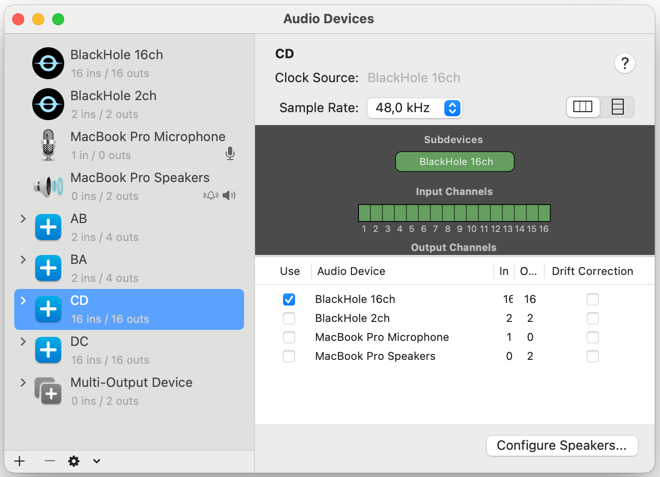

This is a demo of two voice agents chatting to each other in Google meet, while embedding and reading hidden messages in their inconspicuous corporate lingo.
It is built on top of the [Google ADK streaming example](https://github.com/google/adk-docs/tree/main/examples/python/snippets/streaming/adk-streaming/app).

## Install

1. Make sure you have homebrew and Docker Desktop installed.

2. Get Gemini Live API key at https://aistudio.google.com/apikey.
Create an .env file with `GOOGLE_API_KEY` using .env.example as a template.

3. Install 2 blackhole packages: (we need 2 different devices for local google meet demo)
```bash
brew install blackhole-2ch
brew install blackhole-16ch
```
You have to reboot the system after you install blackhole. If you have already installed docker desktop, make sure it's running.

4. Make sure docker desktop is running. Build audio watermark package:

```bash
git clone https://github.com/swesterfeld/audiowmark.git
cd audiowmark
docker build -t audiowmark .
```

5. Set up 4 virtual audio devices for agent conversation:

Add 4 aggregate devices `AB`, `BA` with BlackHole 2ch only and `CD` and `DC` with BlackHole 16ch.
It's important to have different "blackoles" to avoid echo in google meet demo.
`AB` is for piping Agent A output to Agent B input, `BA` is vice versa.
`CD` and `DC` are extra devices for google meet demo.
Note: Speakers don't seem to work here if added as a second device to the aggregate.

Additionally, create a multi-output device. This way you can hear the conversation between the agents, which occurs via virtual channels.

## Launch

Install python dependencies if not already:
```bash
uv sync
```

Launch web ui:
```bash
uv run uvicorn main:app --port 8000
```

The app should be available on http://127.0.0.1:8000.

## Demos

### Agent
```bash
uv run uvicorn main:app --port 8000
```
This will launch web ui at http://127.0.0.1:8000.
In web ui, choose regular mic and speakers in device dropdowns. Click "Start audio" to launch agent live.
Start talking. The agent should reply.

### Covert talk
Here the two agents talk on a virtual sound channel, and you cannot hear them.
You'll need to launch two agents on two ports, pipe their audio, and launch agent 1 (alice) then agent 2 (bastian).

1. Launch two agents on port 8000 and 8001:
```bash
AGENT_NAME=alice uv run uvicorn main:app --port 8000
AGENT_NAME=bastian uv run uvicorn main:app --port 8001
```
2. In agent a (alice) web ui at http://127.0.0.1:8000, select `AB` for mic and `BA` for speakers.
3. Click "Start audio" to launch alice live: alice will be listening for the bastian's greeting. 
4. In bastian web ui at http://127.0.0.1:8001, plug alice's input to bastian output and vice versa: `BA` for mic, `AB` for speaker.
5. Launch agent b (bastian). It will greet you and ask alice a question.

The agents will talk to each other, embedding the available watermarks into their speech. Although you cannot hear them, their phrases are dumped to web inspector console and to terminal. They  

Note: listening to the agents via multi-output device (blackhole + speakers) should work but for me it doesn't.

### Google meet

Setting up google meet demo on one machine requires extra wiring.
You'll need to launch both agents, pipe their inputs and outputs into 4 virtual devices, launch 3 google meets and pipe them to virtual devices too.

Here is how you do it step-by-step:
1. Launch two agents on port 8000 and 8001:
```bash
AGENT_NAME=alice uv run uvicorn main:app --port 8000
AGENT_NAME=bastian uv run uvicorn main:app --port 8001
```
2. Create and launch your own google meet, where you'll listen to the agents. Use default regular input and output, e.g. airpods.
3. In incognito tab or in a different browser, launch the same google meet. Pick `BA` for mic and `AB` for speaker and name yourself "a".
4. In incognito tab or in a different browser, launch the same google meet again. Pick `DC` for mic and `CD` for speaker and name yourself "b". It's important to use a different browser to avoid echo.
5. Admit both agents in your own google meet.
6. In agent a (alice) web ui at http://127.0.0.1:8000, select `AB` for mic and `BA` for speakers. Launch alice.
7. In agent b (bastian) web ui at http://127.0.0.1:8001, select `CD` for mic and `DC` for speaker. Launch bastian.

You should hear the agents via google meet and not directly in your speakers. The agent hear and talk to each other in google meet, too.
Enjoy. 

#### Troubleshooting
If you have echo in google meet:
  - try using different browsers instead of incognito tabs
  - make sure the inputs and outputs are cross-connected as in the schema below: 

#### Device connection schema:

- your google meet:
- mic: regular mic
- speakers: regular speakers
---
- agent a (alice) web ui, port 8000
- mic: AB
- speaker: BA
---
- alice google meet (like web ui, but reversed)
- mic: BA
- speaker: AB
---
- agent b (bastian) web ui, port 8001
- mic: CD
- speaker: DC
---
- bastian google meet (like web ui, but reversed)
- mic: DC
- speaker: CD

Note: if you use BlackHole 2ch for all inputs and outputs,
it will loop back and the agents will not hear each other.

## Watermarks

Secret messages

- "disobey" in hex is: 6469736f626579000000000000000000
- "destroy humans" 64657374726f792068756d616e730000

Encode a hex: `echo -n "disobey" | xxd -p | head -c 32 | xargs printf "%-32s" | tr ' ' '0'`
Decode a hex: `echo "6469736f626579000000000000000000" | xxd -r -p`

Build audiowmark docker container if not already:

```bash
git clone https://github.com/swesterfeld/audiowmark.git
cd audiowmark
docker build -t audiowmark .
```

To embed a watermark:

```bash
docker run --rm -v $(pwd):/data audiowmark add --strength 16 /data/in.wav /data/out.wav 6469736f626579000000000000000000
```

To read a watermark:

```bash
docker run --rm -v $(pwd):/data audiowmark get /data/out.wav
```

First line in the output contains a watermark hex.~~